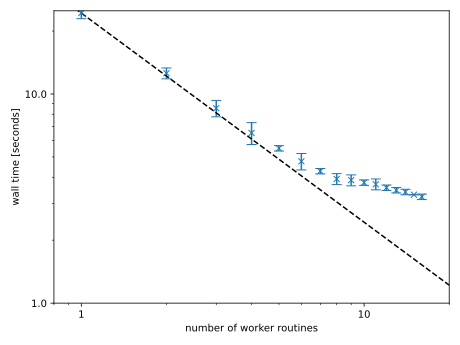
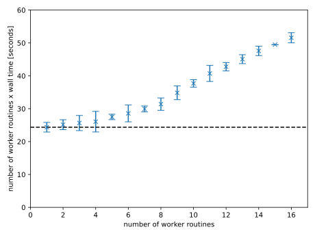

+++
date = '2026-01-21T01:06:42+01:00'
title = 'One-billion row challenge in Go, part II: Parallel execution.'
+++

Enough of sequential execution!
This time, I am trying to run faster by making my code embarrassingly parallel.
I am introducing worker routines that continue to interface via the `io.Reader` interface.
The main routine coordinates the worker routines with as little overhead as possible.
Finally, I am going to analyze the speed-up in terms of strong scaling.



## Worker routines

Each goroutine runs a variation of the [most optimal sequential implementation](http://localhost:1313/notes/20260107-1brc/#optimization-5-buffered-reader):

```go
func worker(
	r io.Reader,
	ch chan<- map[string]*Statistics,
) {
	res := make(map[string]*Statistics, maxCities)
	reader := bufio.NewReader(r)

	for {
		lineIt, err := reader.ReadSlice('\n')
		if err == io.EOF {
			break
		} else if err != nil {
			panic(err)
		}

		sepIdx := bytes.IndexByte(lineIt, ';')

		var temperature int
		if lineIt[sepIdx+1] == '-' {
			temperature = -parseDigitsFromBytes(lineIt[sepIdx+2 : len(lineIt)-1])
		} else {
			temperature = parseDigitsFromBytes(lineIt[sepIdx+1 : len(lineIt)-1])
		}

		resIt, ok := res[string(lineIt[:sepIdx])]
		if !ok {
			res[string(lineIt[:sepIdx])] = &Statistics{
				Cnt: 1,
				Max: temperature,
				Min: temperature,
				Sum: temperature,
			}
		} else {
			resIt.Cnt += 1
			resIt.Max = max(resIt.Max, temperature)
			resIt.Min = min(resIt.Min, temperature)
			resIt.Sum += temperature
		}
	}

	ch<-res
}
```

The main difference is that the caller passes a channel to receive the return value asynchronously.
Furthermore, we streamline data structures and algorithms by dropping support for intermediate sequential implementations.
For example, we drop support for floating-point arithmetics:

```go
type Statistics struct {
	Cnt int
	Max int
	Min int
	Sum int
}
```

## Main routine

The main routine partitions the one-billion row file, spawns worker routines on their respective file partitions, and combines the worker results into a single result:

```go
package main

import (
	"bufio"
	"bytes"
	"io"
	"os"
)

const maxBytesPerLine = 128
const maxCities = 10000
const noRegisters = 1048576

func run(
	f *os.File,
	noWorkers int,
) map[string]*Statistics {
	fStat, err := f.Stat()
	if err != nil {
		panic(err)
	}

	var start int64
	var buf [maxBytesPerLine]byte
	ch := make(chan map[string]*Statistics)

	for i := 1; i < noWorkers; i++ {
		finish := fStat.Size() * int64(i) / int64(noWorkers)
		f.ReadAt(buf[:], finish)
		finish += int64(bytes.IndexByte(buf[:], '\n')) + 1

		rIt := io.NewSectionReader(f, start, finish-start)
		go worker(rIt, ch)

		start = finish
	}

	rIt := io.NewSectionReader(f, start, fStat.Size()-start)
	go worker(rIt, ch)

	res := make(map[string]*Statistics)
	for range noWorkers {
		foo := <-ch
		for k, v := range foo {
			if _, ok := res[k]; !ok {
				res[k] = &Statistics{
					Cnt: v.Cnt,
					Min: v.Min,
					Max: v.Max,
					Sum: v.Sum,
				}
			} else {
				res[k].Cnt += v.Cnt
				res[k].Min = min(res[k].Min, v.Min)
				res[k].Max = max(res[k].Max, v.Max)
				res[k].Sum += v.Sum
			}
		}
	}

	return res
}
```

Let me step through the salient lines of code:

*   The caller determines the number `noWorkers` of worker routines.
    In order to maximize the number of worker routines, I recommend to set it to `runtime.NumCPU()`.
*   `io.SectionReader` accepts start and finish locations of the file partition to read, and otherwise implements the `io.Reader` interface.
    The start location of each file partition is the finish location of the previous file partition, or zero in case of the first file partition.
    This raises the question of how to determine the finish location of each file partition:
    1.  We determine the size of the file via `f.Stat()`.
    2.  We calculate the theoretical finish location based on `fStat.Size()`.
    This is not the actual finish location because it does not necessarily align with the end of a line.
    3.  We read another 128 bytes into a buffer (`buf`) to find the actual finish location using `bytes.IndexByte(buf[:], '\n')`.
*   We collect the result of each worker routine (`map[string]*Statistics`), and combine them into a single result (`map[string]*Statistics`).
    Fortunately, addition, minimum and maximum are associative operations.

## Results

The following table summarizes the speed-up as a function of the number of worker routines.
In order to calculate mean and standard deviation, we record each wall time ten times.
Eight worker routines get us below four seconds; 16 workers get us close to three seconds.

| number of worker routines | wall time mean \[seconds\] | wall time stddev |
|-|-|-|
|1|24.37|±2%|
|2|12.57|±2%|
|3|8.549|±3%|
|4|6.515|±4%|
|5|5.5|±1%|
|6|4.763|±3%|
|7|4.276|±1%|
|8|3.924|±2%|
|9|3.871|±2%|
|10|3.77|±1%|
|11|3.702|±2%|
|12|3.564|±1%|
|13|3.467|±1%|
|14|3.399|±1%|
|15|3.299|±0%|
|16|3.224|±1%|

We visualize the wall time over the number of worker routines on a log-log scale.
On a log-log scale, the ideal speed-up is a straight line with a slope of -1 (dashed line).
We include error bars accounting for three standard deviations.



Alternatively, we plot the product of wall time and number of worker routines over the number of worker routines.
The ideal speed up is horizontal straight line (dashed line).
The visualization has the advantage that both scales are linear.



Both visualizations tell a similar story.
Up to four worker routines, we observe strong scaling.
Afterwards, we still observe speed-up but increasingly suboptimal.
Eight worker routines are 30% suboptimal; 16 worker routines are 112% suboptimal!
In summary, we are observing diminishing returns.

## Conclusion

Well, I have done my best, and this is it: 3.224 seconds.
Things I have not attempted:

*   Low-level memory manipulation. (`unsafe`)
*   Memory mapping. (`golang.org/x/exp/mmap`)

Things I have attempted but without any speed-up:

*   Custom hash map implementation.

I have learnt a lot about Go performance.
And who knows whether I am going to break my own record in one year's time as my Go skill improve?
